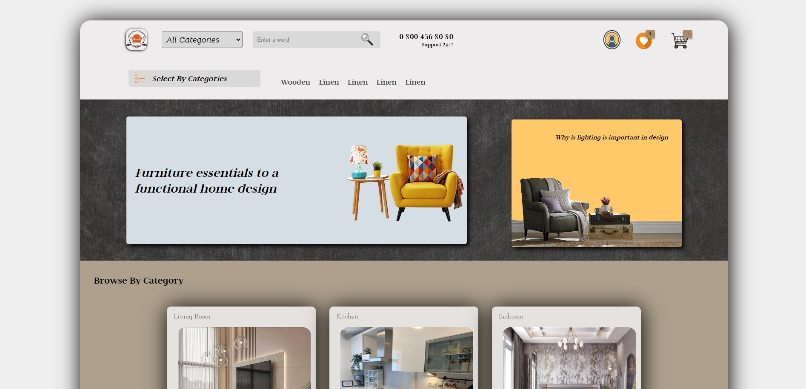

# Home Furnishing Website

This project is a website for a fictional home furnishing store, showcasing various categories of furniture and accessories.

## Technologies Used

- HTML5
- CSS3
- Google Fonts API

## Features

- Responsive design for mobile and desktop
- Navigation bar with category selection
- Search functionality
- Contact form for consultation
- Footer with links to privacy policy and terms of service

# Ev Mobilyası Web Sitesi

Bu proje, çeşitli mobilya ve aksesuar kategorilerini sergileyen, kurgusal bir ev mobilyası mağazasının web sitesidir.

## Kullanılan Teknolojiler

-HTML5
- CSS3
- Google Fonts API

## Özellikler

- Mobil ve masaüstü için duyarlı tasarım
- Kategori seçimli gezinme çubuğu
- Arama işlevi
- Danışma için iletişim formu
- Gizlilik politikasına ve hizmet şartlarına bağlantılar içeren altbilgi

[Canlı Demo'yu Deneyin](https://homefurn.netlify.app/)
